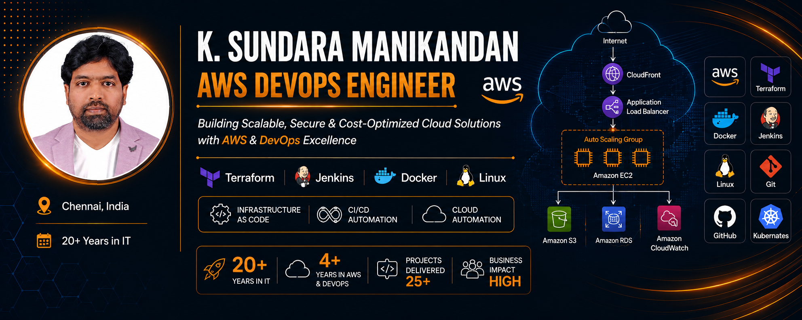

  

<h1 align="center">
Hi 👋 I'm K. Sundara Manikandan
</h1>

  <strong>AWS DevOps Engineer | Cloud Infrastructure | Terraform | CI/CD | Docker</strong>

  AWS DevOps Engineer with 3+ years of specialized AWS & DevOps experience and 20+ years of overall IT experience.

## 👨‍💻 About Me

☁️ AWS DevOps Engineer focused on secure, scalable and highly available cloud infrastructure.

🏗️ Hands-on experience with AWS infrastructure provisioning and automation using Terraform.

🚀 Experienced in Jenkins CI/CD pipelines with Git, Maven, SonarQube and Nexus Repository.

🐳 Experienced with Docker and knowledgeable in Kubernetes, Amazon EKS and Helm.

🔐 Strong focus on AWS networking, IAM, security, troubleshooting and production support.

📊 Monitoring and observability experience with Amazon CloudWatch, Prometheus, Grafana and New Relic.

🤖 Hands-on knowledge of Amazon Bedrock for exploring foundation models, generative AI capabilities and API-based integration with AWS applications.

🌍 Open to AWS DevOps / Cloud / Infrastructure opportunities.

## 🛠️ Technical Skills

### ☁️ AWS Cloud
EC2 🔹 VPC 🔹 Subnets 🔹 IAM 🔹 S3 🔹 RDS 🔹 Route 53 🔹 CloudFront 🔹 Lambda 🔹 API Gateway 🔹 ALB 🔹 Auto Scaling 🔹 SQS 🔹 SNS 🔹 EBS 🔹 EFS 🔹 AWS Backup 🔹 CloudWatch 🔹 CloudTrail

### 🏗️ Infrastructure as Code
Terraform

### 🚀 CI/CD & Build Automation
Jenkins 🔹 Git 🔹 GitHub 🔹 Maven 🔹 SonarQube 🔹 Nexus Repository

### 📊 Monitoring & Observability
Prometheus 🔹 Grafana 🔹 Amazon CloudWatch 🔹 CloudTrail 🔹 New Relic

### 🐳 Containers & Orchestration
Docker 🔹 Kubernetes — Knowledge 🔹 Amazon EKS — Knowledge 🔹 Helm — Knowledge

### 🖥️ Scripting & Configuration
Bash 🔹 Shell Scripting 🔹 YAML 🔹 HTML5 🔹 CSS3 🔹 Python — Basic

### 💻 Operating Systems
Amazon Linux 🔹 Windows

### 🌐 Networking
TCP/IP 🔹 DNS 🔹 HTTP/HTTPS 🔹 SSH 🔹 VPC 🔹 Public/Private Subnets 🔹 NAT Gateway 🔹 Internet Gateway 🔹 Route Tables 🔹 Load Balancing

### 🔐 Security
IAM 🔹 Security Groups 🔹 Secrets Management 🔹 Least-Privilege Access 🔹 Secure Configuration

### 🗄️ Databases
SQL 🔹 PostgreSQL — Knowledge

### 🤝 Collaboration & ITSM
Jira 🔹 Confluence 🔹 Agile/Scrum

### 🤖 AI & Productivity
ChatGPT 🔹 Microsoft Copilot 🔹 Claude 🔹 Amazon Bedrock

## 💼 Professional Experience
### AWS DevOps Engineer
**Official Designation: Senior Multimedia Developer**

**Sify Digital Services Limited**  
📍 Chennai, India  
📅 *April 2023 – Present*

☁️ Design, provision and manage secure, scalable and highly available AWS infrastructure supporting application workloads.

🏗️ Automate AWS infrastructure provisioning using Terraform, reusable modules and version-controlled configurations.

🚀 Build and maintain Jenkins CI/CD pipelines integrated with Git, Maven, SonarQube and Nexus Repository.

📦 Manage Nexus Repository for storing, versioning and managing build artifacts across application delivery workflows.

⚡ Automate CI/CD deployment workflows using Jenkins, reducing deployment time by **60%** and minimizing manual intervention.

🌐 Design and configure AWS VPC networking with public/private subnets, route tables, Internet Gateway and NAT Gateway.

🔐 Manage IAM users, roles and policies using least-privilege access principles; configure security groups and secure access controls.

🐳 Build and manage Docker images; knowledge of Kubernetes, Amazon EKS and Helm.

📊 Configure Prometheus, Grafana and Amazon CloudWatch for monitoring, dashboards, logs and operational alerting.

🤖 Hands-on knowledge of Amazon Bedrock for exploring foundation models, generative AI capabilities and API-based integration with AWS applications.

🛠️ Perform root-cause analysis and troubleshooting across AWS infrastructure, CI/CD pipelines, permissions and network connectivity.

🔄 Support production releases, validation, issue resolution and rollback/recovery activities across Development, QA, UAT and Production environments.

🤝 Collaborate with Development, QA and Operations teams within Agile/Scrum processes using Jira and Confluence.

### Senior Multimedia Developer
**Sify Digital Services Limited**  
📍 Chennai, India  
**Nov 2015 – Mar 2023**

🎓 Designed and developed interactive e-learning applications using Articulate Storyline and Adobe Creative Suite.

🤝 Translated business and client requirements into interactive learning solutions and coordinated cross-functional delivery activities.

🛠️ Performed application maintenance, troubleshooting and production support to maintain reliability and user satisfaction.

📋 Managed project deliverables and timelines while coordinating with internal teams and stakeholders.

## 📚 Earlier Career Experience

| Role | Organization | Period |
|---|---|---|
| Senior Software Engineer | Mahindra Satyam, Chennai | 09/2010 – 04/2013 |
| Senior Graphic Designer | Helix Technology Solutions, Hyderabad | 07/2009 – 08/2010 |
| Associate Consultant | Satyam Computer Services, Chennai | 10/2006 – 06/2009 |
| Senior Web Developer | Lionbridge Technologies, Chennai | 04/2005 – 10/2006 |
| Multimedia Developer | Sify Ltd., Chennai | 08/2002 – 04/2005 |

# 🚀 Featured Projects

### 🏗️ AWS Three-Tier Web Application
**Technologies:** AWS • Terraform • VPC • EC2 • ALB • Auto Scaling • RDS • CloudWatch • SNS

- Designed a scalable multi-tier AWS architecture using public/private networking.
- Provisioned infrastructure using Terraform.
- Implemented load balancing, Auto Scaling and managed database integration.
- Added CloudWatch monitoring and SNS-based notifications.

# 

### 🖼️ AWS Serverless Image Gallery
**Technologies:** AWS S3 • Lambda • API Gateway • IAM • CloudWatch • JavaScript • HTML5 • CSS3

- Built a serverless image gallery using S3, Lambda and API Gateway.
- Implemented API-based application interaction and AWS IAM access controls.
- Used CloudWatch for operational monitoring and troubleshooting.
- Developed the front end using JavaScript, HTML5 and CSS3.

# 🚀 Live Project

| Project | Live Demo | Source Code |
|---------|-----------|-------------|
| 🖼️ AWS Serverless Image Gallery | 🌐 [https://my-image-gallery-2026.s3.amazonaws.com/index.html](https://my-image-gallery-2026.s3.amazonaws.com/index.html) | 💻 [GitHub Repository](https://github.com/nirumanii/aws-image-gallery) |

##  Terraform AWS Infrastructure Automation – Nginx Web Server Deployment Technologies

Automated AWS infrastructure provisioning using Terraform by deploying a custom VPC, networking components, and an EC2 instance with automated Nginx installation, following Infrastructure as Code (IaC) best practices.

# 

### 🚀 AWS Elastic Beanstalk Application
**Technologies:** AWS Elastic Beanstalk • EC2 • ALB • Auto Scaling • RDS

- Deployed an application using AWS Elastic Beanstalk.
- Configured scalable compute, load balancing and managed database integration.
- Demonstrated AWS application deployment and infrastructure automation concepts.

### 🔔 Patient Notification System
**Technologies:** AWS EC2 • SNS • IAM • CloudWatch

- Built an AWS-based notification workflow using Amazon SNS.
- Integrated EC2 workloads with controlled IAM access.
- Used CloudWatch monitoring and email notifications for operational events.

### 📊 DevOps / Cloud Architecture

                         👨‍💻 Developer
                              │
                              ▼
                    ┌──────────────────┐
                    │   Git / GitHub   │
                    └────────┬─────────┘
                             │
                             ▼
                    ┌──────────────────┐
                    │     Jenkins      │
                    │     CI / CD      │
                    └────────┬─────────┘
                             │
                 ┌───────────┼───────────┐
                 ▼           ▼           ▼
              Maven      SonarQube    Nexus
             Build       Quality      Artifacts
                 └───────────┼───────────┘
                             │
                             ▼
                    ┌──────────────────┐
                    │      Docker      │
                    └────────┬─────────┘
                             │
                             ▼
                    ┌───────────────────┐
                    │ AWS Infrastructure│
                    │    Terraform      │
                    └────────┬──────────┘
                             │
             ┌───────────────┼────────────────┐
             ▼               ▼                ▼
          VPC / IAM        EC2 / ALB        S3 / RDS
             │            Auto Scaling        │
             └───────────────┼────────────────┘
                             ▼
                    ┌────────────────────┐
                    │ Monitoring & Ops   │
                    │ CloudWatch         │
                    │ Prometheus         │
                    │ Grafana / New Relic│
                    └────────────────────┘

## 🎓 Education
| Degree | Institution | Duration |
|---------|-------------|----------|
| 🎓 Bachelor of Engineering (Mechanical Engineering) | 🏛️ Madurai Kamaraj University, India | 📅 Oct 1997 – Nov 2002 |

## 📫 Connect With Me

📱 **Mobile:** +91 98408 72480

📧 **Email:** kmani79@gmail.com

💼 [LinkedIn](https://www.linkedin.com/in/mani-aws-devops/) 

🐙 [GitHub](https://github.com/nirumanii/mani-aws-devops)

## 📄 Resume

  

